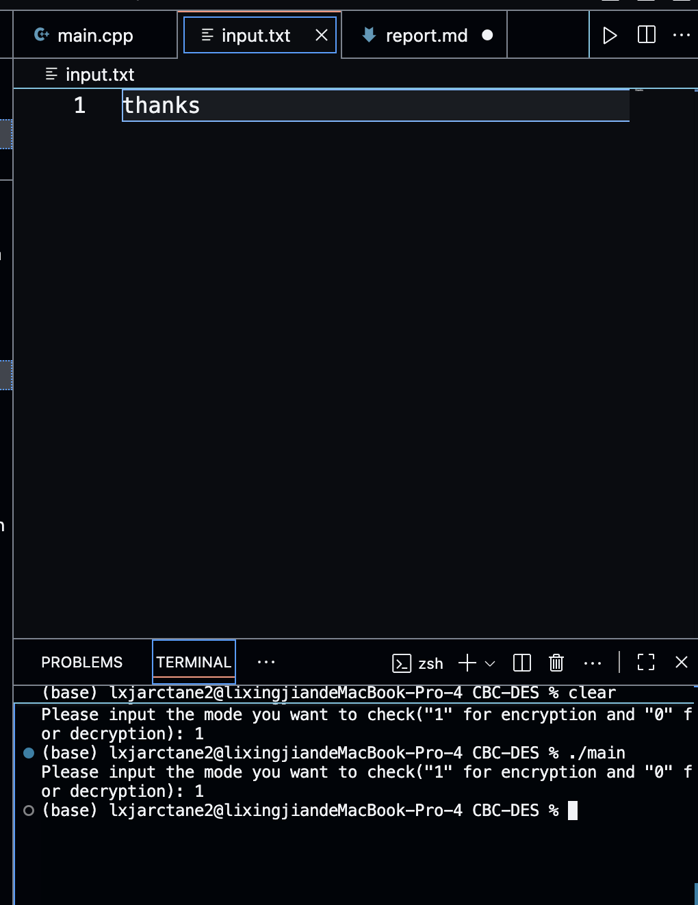
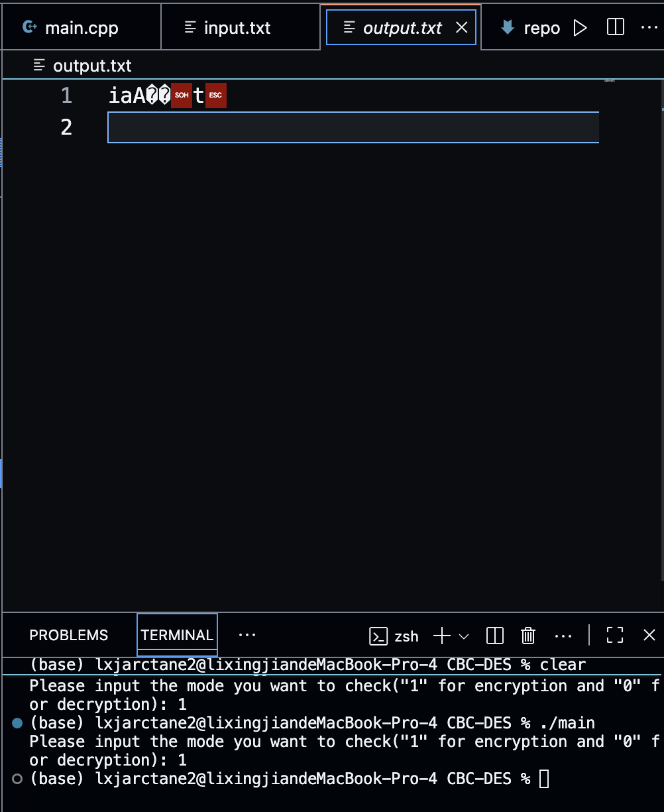
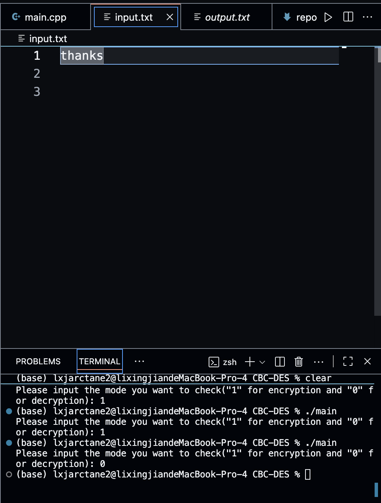

## 网络安全引论第一次实验报告
### 实现DES加密解密算法

利用课程提供的代码框架实现DES核心函数

#### os=macos arch=arm64 standard=c++23

#### DES加密算法流程：
初始换位->16次迭代加密->1次32位左右交换->初始换位的逆操作

解密算法是反过来的，在迭代加密过程中密钥按照反顺序使用

#### 框架代码里面有五处需要补充：

##### 1. 迭代加密里面的扩展换位，将32位扩展到48位，利用transformantion_matrix.h里面的E数组进行换位
```
void extendTransposition(bool *text)
{ 
    // 已实现
    bool tmp[48];
    for(int i=0;i<48;i++)
    {
        tmp[i]=text[E[i]-1];
    }
    copy(text,tmp,48);
}
```

##### 2. PC2置换 也是换位置换 56bit到48bit
```
void PC2Transposition(bool *text, bool *output)
{
    // 已实现
    for(int i=0;i<48;i++)
    {
        output[i]=text[PC_2[i]-1];
    }
}
```

##### 3.S盒换位 6位6位取出，索引0和5的合并成行数，索引1 2 3 4合并成列数 根据S盒矩阵，算出4位换位后数据 最后再拼接
```
void SBoxTransposition(bool *input, bool *output)
{ 
    // 已实现
    // bit2dec dec2bit是我自己实现的函数 分别是将二进制串转换成10进制数 10进制数转换成二进制串
    for(int i=0;i<48;i+=6)
    {
        bool line[2]={input[i],input[i+5]};
        bool column[4]={input[i+1],input[i+2],input[i+3],input[i+4]};
        int line_sign=bit2dec(line,2);
        int col_sign=bit2dec(column,4);
        bool* val=dec2bit(S_Box[i/6][line_sign][col_sign]);
        for(int j=i/6*4;j<i/6*4+4;j++)
        {
            output[j]=val[j-i/6*4];
        }
        if(val!=NULL) delete[] val;
    }
}
```

##### 4.32位左右换位 
```
void halfSwap(bool *text)
{ 
    // 已实现
    bool tmp;
    for(int i=0;i<32;i++)
    {
        tmp=text[i];
        text[i]=text[i+32];
        text[i+32]=tmp;
    }
}
```

##### 5. 逆初始变换
```
void inverseTransposition(bool *text)
{ 
    // 已实现
    bool tmp[64];
    copy(tmp,text,64);
    for(int i=0;i<64;i++)
    {
        text[i]=tmp[I_IP[i]-1];
    }
}
```

#### 对原本框架代码的修正
##### 1. pad函数里面如果遇到8及8的倍数会多生成8个padding
修正后：
```
void pad(string &text)
{ 
    int padding;
    if(text.length()==0||text.length()%8!=0) padding = 8 - text.length() % 8;
    else padding = 0;
    int val = padding;
    char buf;
    buf=('0'+val-0);
    for (int i = 0; i < padding; i++)
        text += buf;
}
```

##### 2. 加密解密文件输出流循环用的仍然是外层循环的i，应改为j

#### 运行演示
加密input.txt


密文展示


密文解密后
