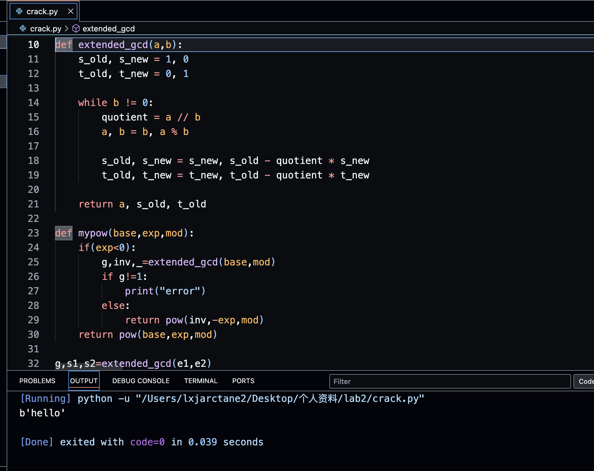

### 共模攻击破解RSA加密密文

##### 实验环境：os=macos M1 arch=arm64 IDE=VScode venv=Python 3.12.8

#### 破解思路：
因为两次加密时N相同，可以根据扩展欧几里得算法算出e1和e2的贝族系数s1 s2，从而算出明文值
```
	e1*s1+e2*s2=1
	((c1^s1)*(c2^s2))modN=m
```

#### 核心代码：
实现扩展欧几里得算法
```
def extended_gcd(a,b):
    s_old, s_new = 1, 0
    t_old, t_new = 0, 1
    
    while b != 0:
        quotient = a // b
        a, b = b, a % b
        
        s_old, s_new = s_new, s_old - quotient * s_new
        t_old, t_new = t_new, t_old - quotient * t_new
        
    return a, s_old, t_old
```

因为s1 s2是一正一负，所以对那个负指数幂，需要求其逆元再pow操作,所以我设置一个mypow来分类操作
```
def mypow(base,exp,mod):
    if(exp<0):
        g,inv,_=extended_gcd(base,mod)
        if g!=1:
            print("error")
        else:
            return pow(inv,-exp,mod)
    return pow(base,exp,mod)
```

#### 运行展示
