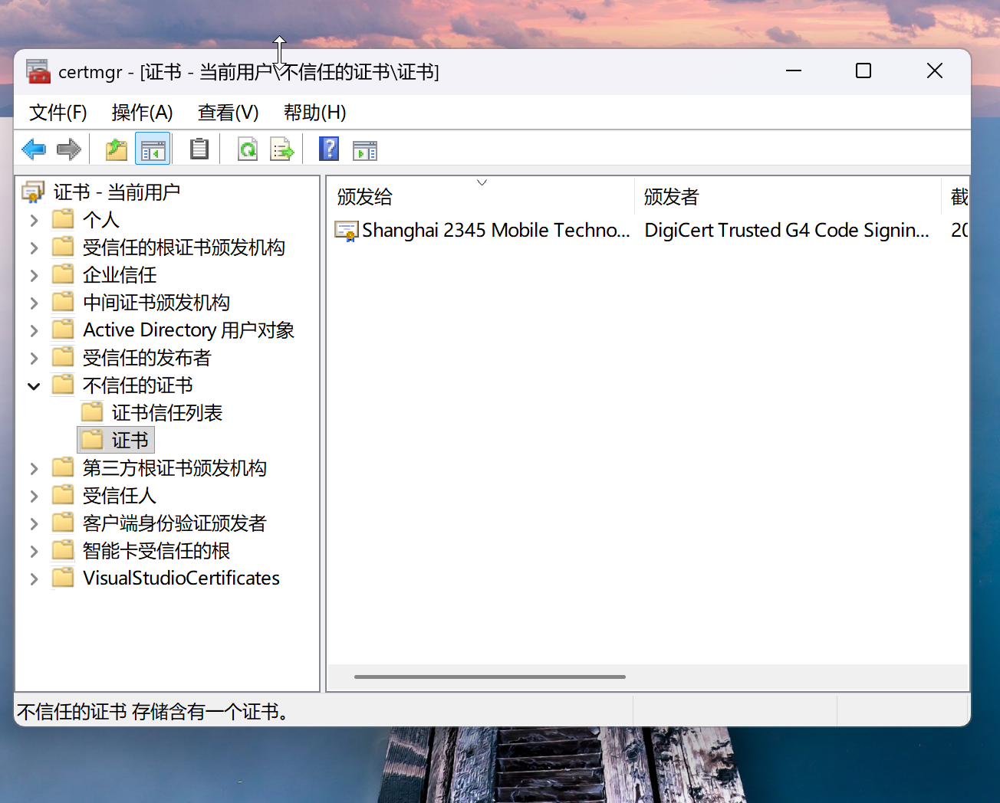
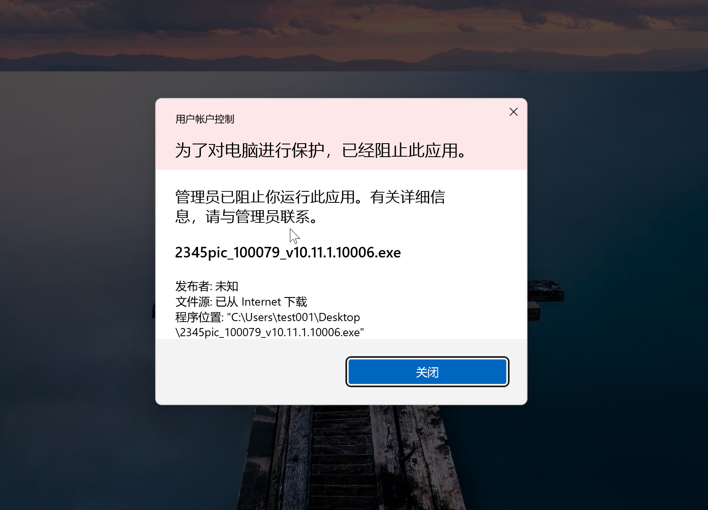
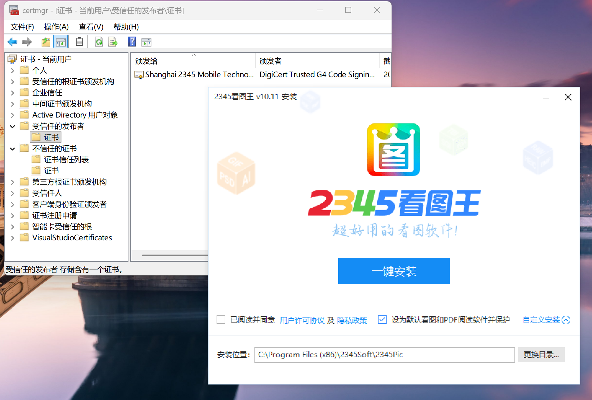

## 实验2 数字证书预防流氓软件安装

#### 实验环境：虚拟机 os：Windows 11 家庭版 arch：arm  processor：Apple Sillicon 

### 实验过程

先将实验材料里面的安装包全部打开，按照默认设置，安装在C盘的默认路径上，发现都可以顺利安装，但是未出现题目描述中“捆绑安装”的现象，但是根据日常生活经验，在Win7和之前Win10的系统上，这种捆绑现象非常普遍

再根据步骤，将这几个软件的数字签名，全部放入系统证书管理器的“不信任证书”栏内

再点击安装包，发现爆出安全提示，无法安装，成功阻止流氓软件安装

如果想要恢复运行，需将证书移出不信任列表，并将证书添加进信任列表

win系统如果想要绕开安全证书验证，可以通过重启进入高级启动设置关闭驱动器数字证书验证，或者利用管理员权限运行bcdedit /set testsigning on指令并重启关闭证书验证

