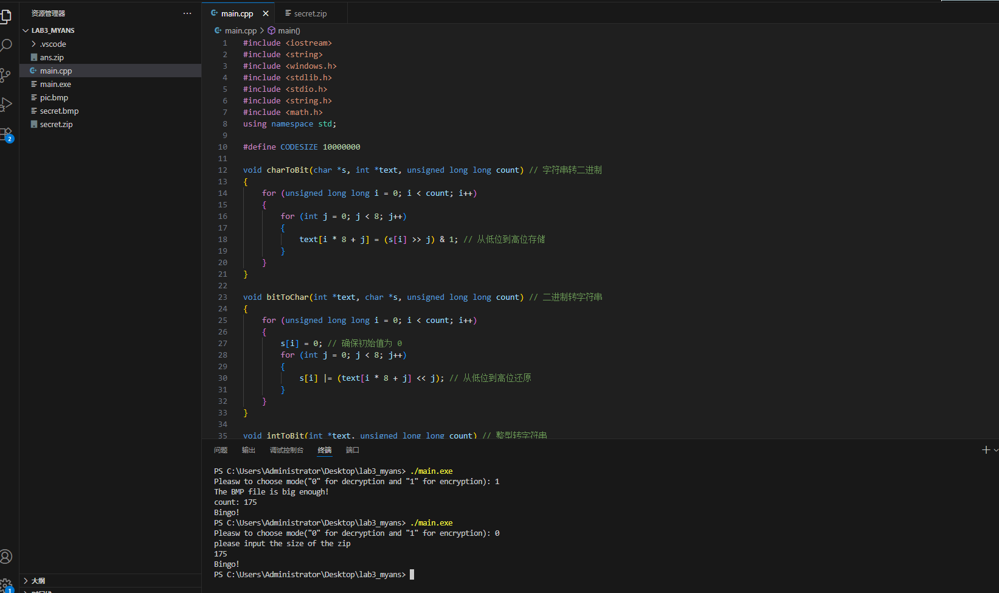
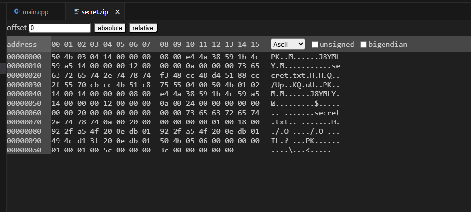
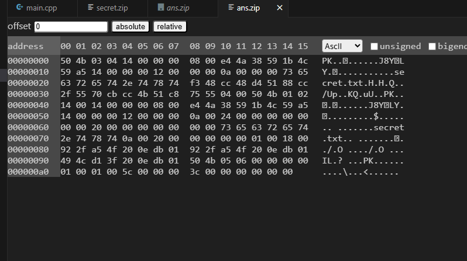

## 实验三 实现LSB隐写算法

##### 实验环境： os：Windows 10 arch：x86-64 

### 实验思路
存入思路核心：将secret.zip文件以字符串读入再转换成bit串，存入pic.bmp的rgb段每个字节最低位
提取思路核心：将存入生成的secret.bmp图片解析，去掉信息头，拿到rgb段，根据输入的读取大小，提取对应字节的最低位组成字符串，写入ans.zip

隐写核心函数 embedMessage
```c
void embedMessage(int* l,int* f,int len)
{
    // 已实现
    for(int i=0;i<len;i++)
    {
        l[i]=f[i]|(l[i]&0xFE);
    }
}
```

提取核心函数 extractMessage
```c
void extractMessage(int* r,int* f,int len)
{
    // 已实现
    for(int i=0;i<len;i++)
    {
        f[i]=r[i]&1;
    }
}
```

注：为了匹配日常使用习惯，我将模版里面bit2char和char2bit两个函数都进行了相应修改，让每个字节的最低位都出现在bit串相应索引小端

### 运行截图及结果展示


