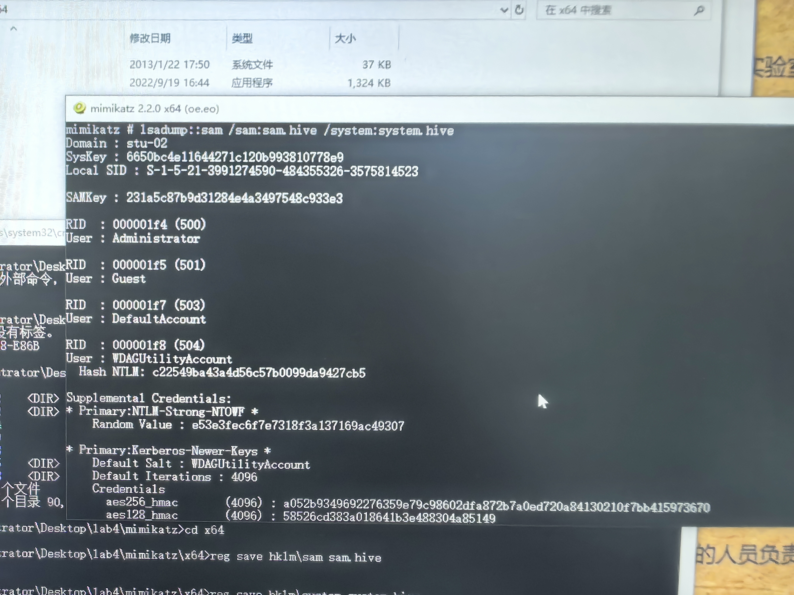

## 实验四 破解windows加密口令

##### 实验环境 os: Windows10 教育版 arch: amd64 processor: intel core i5-8500

### 第一部分 利用mimikatz得到哈希值
输入```lsadump::sam /system:systemhivepath /sam:samhivepath```指令
得到目标用户lab的口令哈希值


### 第二部分 利用sam暴力破解密码
将对应的NT哈希值导入sam，暴力破解，发现六位的abc123密码无法破解，三位的abc密码可以破解


破解不了可能是因为位数太大，所需时间和规模超出了软件的规定，导致无法破解
如果事先知道密码的一些特征，并把规则导入，应该会更快

### 第三部分 利用ophcrack彩虹表破解
将对应的NT hash导入，并配置好彩虹表，开始破解，发现两个都可以破解


### 第四部分 自行尝试破解本机的一个用户密码
通过网上浏览，我找到导出本机用户system和sam数据库的方法


把他们放入minikatz，得到一个用户的NT hash


先尝试暴力破解，发现不可行，可知密码长度可能大于3


再尝试用彩虹表破解


发现也无法破解，一个可能是密码长度过大，还有可能是当前导入的彩虹表不适配于破解该密码


